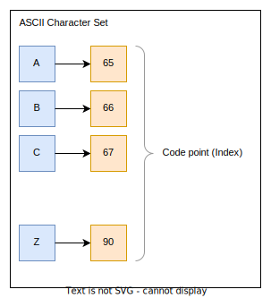
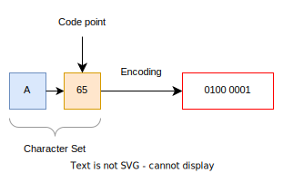
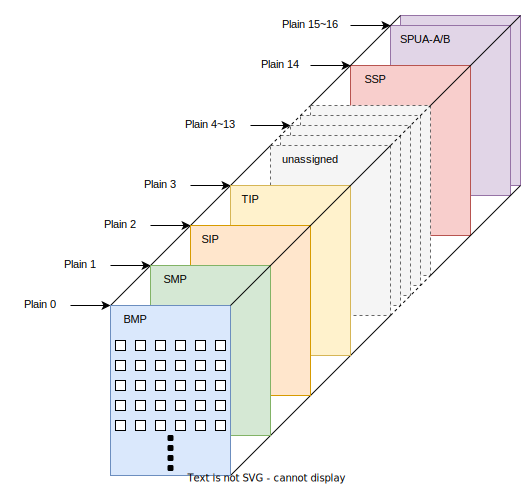
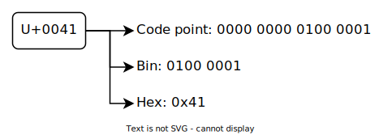
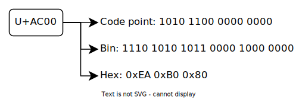
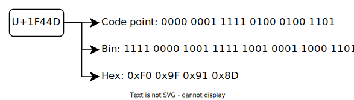

# 문자 데이터 표현

---

컴퓨터는 2진수를 사용하므로 문자 데이터 또한 0과 1로 변환해서 표현해야 한다.

문자와 특정 숫자를 짝지어 둔것을 문자 코드(Character Set)라 하며 문자 코드를 정해진 규칙대로 2진수 값으로 표현하는 것을 문자 인코딩(Encoding)이라 한다.

## 문자 코드 - Character Set

---

문자를 특정 숫자에 매핑해둔 것을 문자 코드라 하며 다른말로 문자 집합, Character Set이라 한다. 대표적 문자 코드로 ASCII, Unicode 등이 있으며 다음 예는 ASCII 문자 코드의 일부이다.

ASCII 문자 코드에서 문자 'A'는 숫자 65에 매핑되는데 매핑된 숫자 65를 Code point라고 한다. 참고로 Code point는 해당 문자 코드에서 특정 문자를 유일하게 식별할 수 있으므로 Index라고도 한다.

 

## 문자 인코딩 - Encoding

---

문자 인코딩은 문자 코드의 매핑된 숫자를 2진수로 변환하는 것으로 문자 코드상의 Code point를 정해진 규칙에 맞게 비트로 나타내는 것을 말한다.

:::note html 문자 인코딩

HTML 문서에서 문자 인코딩을 나타내는 `<meta charset="UTF-8">`은 굳이 따지면 charset(Character Set)이 아니라 encoding이어야 맞다. UTF-8은 문자 인코딩 방식이지 문자 코드가 아니기 때문이다.

:::

 

## ASCII

---

**A**merican **S**tandard **C**ode for **I**nformation **I**nterchange의 줄임말로 영어 대소문자와 숫자, 일부 특수 문자와 공백 문자를 나타내는 문자 코드다. ASCII는 0에서 127까지 총 128개의 Code point를 가지며 이중 0 ~ 31, 127은 특수한 용도로 쓰이는 제어 문자를 32 ~ 126은 출력 가능한 문자를 나타낸다.

| ASCII Code point |       구분       |
| :--------------: | :--------------: |
|   0 ~ 31, 127    |    제어 문자     |
|     32 ~ 126     | 출력 가능한 문자 |

전체 ASCII 코드표는 다음 자료를 참고하자. [ASCII code chart - wikipedia](https://en.wikipedia.org/wiki/ASCII#Control_code_chart)

### US-ASCII

---

ASCII 문자 코드의 7bit 인코딩으로 문자 코드내 Code point를 그대로 2진수로 변환하는 방식이다. 컴퓨터는 1byte 단위로 데이터를 처리하므로 남는 1bit는 0으로 채우게 된다.

예를 들어 문자 'A'는 ASCII 문자 코드에서 Code point가 65이므로 US-ASCII로 인코딩하면 $0100 \space 0001_{(2)}$이 된다.

 

### ISO/IEC-8859

---

ISO/IEC-8859(ISO-8859)는 기존 ASCII 문자 코드를 확장한 것으로 8bit를 사용하며 ASCII 보다 더 많은 문자를 나타낼 수 있다. 대부분의 서유럽 언어를 나타낼 수 있는 ISO-8859-1(Latin-1)이 비교적 많이 쓰인다.

인코딩 방식은 Code point를 8bit 2진수로 그대로 변환하는 것이며 예를 들어 문자 'À' 를 ISO-8859-1 로 인코딩하면 $1100 \space 0000_{(2)}$ 이 된다.

ISO-8859에 속하는 문자 코드는 다음 자료를 참고하자. [ISO/IEC 8859 - wikipedia](https://en.wikipedia.org/wiki/ISO/IEC_8859#Table)

 

## Unicode

---

Unicode 등장 이전의 문자 코드는 전 세계 모든 언어를 표현하지 못했으므로 각 언어를 나타내기 위해 수 많은 문자 코드가 필요했다. 각 문자 코드는 서로 충돌하기도 했고 서버 프로그램처럼 다양한 언어를 처리해야 하는 경우 수 많은 인코딩을 지원해야 하는 문제도 있었다. 또한 그 과정에서 잘못된 인코딩으로 값이 깨지는 등의 문제도 많았다.

Unicode는 이러한 문제를 해결하기 위한 대안이며 15.0 버전 기준 Code point로 0x0000부터 0x10FFFF까지 사용해서 약 110만개 이상의 문자를 표현할 수 있다.

Unicode를 표시할 때는 U+와 16진수 Code point를 붙혀서 사용한다. 예를 들어 한글 '가'의 Unicode Code point가 'AC00'이므로 '가'는 'U+AC00'이 된다.

각 언어별 Unicode 문자 코드표는 다음 자료에서 확인할 수 있다. [Unicode charts](https://unicode.org/charts/)

### Unicode plane

---

Unicode는 Code point를 일정 개수로 나누어 논리적으로 구분한다. 이 때 구분된 하나하나를 평면(plane)이라 하며 하나의 평면은 $2^{16}$개의 Code point로 구성된다. 15.0 버전 기준 0번 평면부터 16번 평면까지 총 17개의 평면으로 구성된다.

|  plane  |     Code point     | 이름                                                              | 나타내는 문자                             |
| :-----: | :----------------: | ----------------------------------------------------------------- | ----------------------------------------- |
|    0    |  U+0000 ~ U+FFFF   | BMP(Basic Multilingual Plane), 기본 다국어 평면                   | 거의 모든 현대 언어                       |
|    1    | U+10000 ~ U+1FFFF  | SMP(Supplementary Multilingual Plane), 보조 다국어 평면           | 이집트 상형 문자, 설형 문자 등            |
|    2    | U+20000 ~ U+2FFFF  | SIP(Supplementary Ideographic Plane), 보조 표의문자 평면          | CJK 통합 표의 문자 확장                   |
|    3    | U+30000 ~ U+3FFFF  | TIP(Tertiary Ideographic Plane), 3차 표의문자 평면                | CJK 통합 표의 문자 확장                   |
| 4 ~ 13  | U+40000 ~ U+DFFFF  | unassigned                                                        | 할당된 문자 없음                          |
|   14    | U+E0000 ~ U+EFFFF  | SSP(Supplementary Special-purposr Plane), 보조 특수 목적 평면     | 적은 수의 제어용 문자                     |
| 15 ~ 16 | U+F0000 ~ U+10FFFF | SPUA-A/B(Supplementary Private Use Area Planes), 사용자 영역 평면 | 특정 업체, 사용자 별로 할당해서 쓰는 문자 |

각 평면에 할당된 언어에 대한 자세한 정보는 다음 자료를 참고하자 [Unicode Plane](<https://en.wikipedia.org/wiki/Plane_(Unicode)>)

 

### UTF-8

---

UTF 인코딩은 Unicode Code point를 몇 개의 Code unit으로 나누어 인코딩하는 방식으로 대상 문자에 따라 사용하는 byte가 달라진다.

UTF-8의 경우 Code unit을 8bit로 하는 인코딩으로 문자에 따라 1 ~ 4byte를 사용하며 Code point 구간별로 다음과 같은 인코딩 규칙이 적용된다.

|     Code point     |        Scala Value         | 첫번째 바이트 | 두번째 바이트 | 세번째 바이트 | 네번째 바이트 |
| :----------------: | :------------------------: | :-----------: | :-----------: | :-----------: | :-----------: |
|  U+0000 ~ U+007F   |     00000000 0xxxxxxx      |   0xxxxxxx    |               |               |               |
|  U+0080 ~ U+07FF   |     00000yyy yyxxxxxx      |   110yyyyy    |   10xxxxxx    |               |               |
|  U+0800 ~ U+FFFF   |     zzzzyyyy yyxxxxxx      |   1110zzzz    |   10yyyyyy    |   10xxxxxx    |               |
| U+10000 ~ U+10FFFF | 000uuuuu zzzzyyyy yyxxxxxx |   11110uuu    |   10uuzzzz    |   10yyyyyy    |   10xxxxxx    |

출처: [Unicode 15.0 Standard - Table 3-6](https://www.unicode.org/versions/Unicode15.0.0/ch03.pdf)

UTF-8의 인코딩 규칙

- Code point 구간별로 사용하는 바이트 수가 정해진다.
- 1byte를 쓰는 경우 최상위 비트는 0이다.
- 2byte 이상 쓰는 경우 첫번째 바이트의 상위 비트에서 몇 바이트를 사용하는지 나타낸다.
  - 2byte - 110
  - 3byte - 1110
  - 4byte - 11110
- 두번째 바이트부터 상위 2개 비트는 모두 10이다.

UTF-8은 이러한 규칙 때문에 인코딩된 문자가 다른 인코딩된 문자의 일부가 되지 않으며 ASCII와 호환된다. 이 규칙에 맞게 'A', '가', '👍'를 인코딩하면 다음과 같다.

#### UTF-8 'A'

'A'의 Code point는 U+0041로 U+0000 ~ U+007F 범위에 속한다. 따라서 0xxxxxxx 규칙으로 인코딩 된다.

#### UTF-8 '가'

'가'의 Code point는 U+AC00으로 U+0800 ~ U+FFFF 범위에 속한다. 따라서 1110zzzz 10yyyyyy 10xxxxxx 규칙으로 인코딩 된다.

#### UTF-8 '👍'

'👍'의 Code point는 U+1F44D로 U+10000 ~ U+10FFFF 범위에 속한다. 따라서 11110uuu 10uuzzzz 10yyyyyy 10xxxxxx 규칙으로 인코딩 된다.

 

### UTF-16

---

UTF-16은 Code point를 16bit로 하는 인코딩으로 2 또는 4byte를 사용한다. 인코딩할 문자가 BMP에 속하는 경우와 속하지 않는 경우로 나누어 인코딩 규칙이 적용된다.

|     Code point     |        Scala Value        |              UTF-16               |
| :----------------: | :-----------------------: | :-------------------------------: |
|  U+0000 ~ U+FFFF   |     xxxxxxxxxxxxxxxx      |         xxxxxxxxxxxxxxxx          |
| U+10000 ~ U+10FFFF | 000uuuuu xxxxxxxxxxxxxxxx | 110110wwwwxxxxxx 110111xxxxxxxxxx |

_wwww는 uuuuu - 1로 구할 수 있다._

출처: [Unicode 15.0 Standard - Table 3-5](https://www.unicode.org/versions/Unicode15.0.0/ch03.pdf)

#### 써러게이트 - Surrogate

Code point가 16bit(2byte)를 넘는 경우, 즉 BMP에 속하지 않는 문자는 써러게이트 페어(Surrogate pair, 대리쌍)를 이용해서 2개의 16bit Code unit(4byte)으로 인코딩된다.

BMP의 U+D800부터 U+DFFF까지의 Code point는 문자를 나타내지 않으며 반으로 나누어 U+D800 ~ U+DBFF는 상위 써러게이트(High-Surrogate), U+DC00 ~ U+DFFF는 하위 써러게이트(Low-Surrogate)로 사용한다.

써러게이트 페어를 구하려면 상위 써러게이트의 상위 비트는 110110으로 고정, 하위 써러게이트의 상위 비트는 110111로 고정하고 대상 문자의 Code point에서 U+10000을 뺀 값을 20bit로 나타내어 10bit씩 상하위 써러게이트에 붙이면 된다. 이 과정을 단순하게 공식으로 만든 것이 위 표의 내용이다.

각 써러게이트 영역에 속하는 Code point가 1024개 씩이므로 상하위 써러게이트 조합으로 약 100만개 이상의 문자를 표현할 수 있다.

#### 엔디언 - Endian

엔디언은 메모리에 데이터를 저장할 때 바이트의 저장 순서를 말한다. Big Endian, Little Endian 등이 있으며 Big Endian은 낮은 메모리 주소에 상위 바이트부터 저장하고 Little Endian은 낮은 메모리 주소에 하위 바이트부터 저장한다.

예를 들어 0x12345678을 저장할 때 Big Endian이면 12 34 56 78로 저장되고 Little Endian이면 78 56 34 12로 저장된다. UTF-16에서는 이를 Code unit 단위로 적용한다.

써러게이트, 엔디언을 고려해서 UTF-16 으로 '가', '👍' 를 인코딩하면 다음과 같다.

#### UTF-16 '가'

'가'의 Code point는 U+AC00으로 BMP에 속하므로 16bit로 그대로 인코딩된다.

#### UTF-16 '👍'

'👍'의 Code point는 U+1F44D로 BMP에 속하지 않으므로 써러게이트 페어를 이용해서 인코딩된다.

 

### UTF-32

---

UTF-32는 Code point를 32bit 단일 Code unit으로 인코딩하는 방식이다. Unicode 문자의 Code point는 모두 32bit 이하이므로 그대로 변환하면 된다. UTF-16과 마찬가지로 엔디언에 따라 값이 달라진다.

'가'를 UTF-32로 인코딩하면 다음과 같다.

단순한 방식이지만 문자 하나에 4byte가 고정되므로 비교적 많은 공간을 차지한다.

 

### BOM

---

**B**yte **O**rder **M**ark의 줄임말로 문서의 맨 앞에 위치하면서 해당 문서에 적용된 정확한 인코딩 방식을 나타낸다.

|  인코딩  | BOM - Byte Order Mark (Hex) |
| :------: | :-------------------------: |
|  UTF-8   |          EF BB BF           |
| UTF-16BE |            FE FF            |
| UTF-16LE |            FF FE            |
| UTF-32BE |         00 00 FE FF         |
| UTF-32LE |         FF FE 00 00         |

BOM은 선택사항으로 꼭 써야하는 것은 아니다. 다만 사용할 경우 반드시 문서의 맨 앞에 와야한다. 또한 UTF-8은 엔디언 구분이 없으므로 UTF-8에서의 BOM은 문서의 인코딩이 UTF-8임을 나타내는데 BOM자체를 쓰지 않는 것을 권장한다. UTF-16, UTF-32에서는 엔디언을 나타내며 'UTF-16BE' 처럼 인코딩에 엔디언까지 명확하게 표시할 경우 BOM을 쓰면 안된다. BOM이 없는 경우 상위 프로토콜의 형식을 따르며 상위 프로토콜이 없는 경우 일반적으로 Big Endian으로 간주한다.

## Reference

---

- [ASCII - wikipedia](https://en.wikipedia.org/wiki/ASCII)
- [ISO/IEC 8859 - wikipedia](https://en.wikipedia.org/wiki/ISO/IEC_8859)
- [문자를 다루는 인코딩 규칙에 대한 모든 것! - 널널한 개발자](https://www.youtube.com/watch?v=6hvJr0-adtg&t=767s)
- [The Unicode Standard ver(15.0.0) - Unicode Consortium](https://www.unicode.org/versions/Unicode15.0.0/ch03.pdf)
- [Unicode - wikipedia](https://en.wikipedia.org/wiki/Unicode)
- [Unicode와 UTF-8 간단히 이해하기 - Jeong Dowon](https://jeongdowon.medium.com/unicode%EC%99%80-utf-8-%EA%B0%84%EB%8B%A8%ED%9E%88-%EC%9D%B4%ED%95%B4%ED%95%98%EA%B8%B0-b6aa3f7edf96)
- [Unicode 이해하기 - Ryan Park](https://www.slideshare.net/parkpd/unicode-4796992)
- [아스키 코드, 유니코드 그리고 UTF-8, UTF-16](https://dingue.tistory.com/16)
