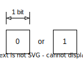
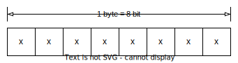
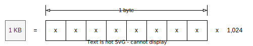
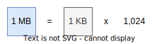
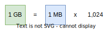
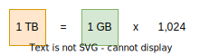
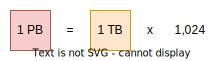
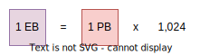
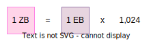
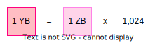

# 데이터 단위

---

컴퓨터는 데이터를 2진수로 표현한다. 가장 작은 단위인 비트는 0 또는 1 하나를 나타내며 크기가 커짐에 따라 바이트, 킬로 바이트, 메가 바이트 등으로 단위가 바뀐다.

## 비트

---

0, 1을 타나낼 수 있는 컴퓨터의 **최소 단위**이다. binary digit을 줄여서 bit(b)라고 한다.

전기 신호가 꺼진 상태를 0, 켜진 상태를 1로 표현하며 n bit는 $2^n$ 가지의 데이터를 표현할 수 있다.

 

## 바이트

---

컴퓨터가 처리하는 정보의 **최소 처리 단위**로 1 byte(B)는 8 bit에 해당한다.

1 byte는 8 bit에 해당하므로 $2^8$ 가지의 데이터를 표현할 수 있으며 이는 영어문자 1자(ASCII 기준)에 해당한다.

 

## 킬로 바이트 ~

---

바이트는 $2^{10}$배 즉 1,024배 커질 때 마다 단위가 바뀐다. 변경되는 단위는 다음과 같다.

킬로 바이트 - Kilo-Byte, **KB** (1KB = 1,024B)

메가 바이트 - Mega-Byte, **MB** (1MB = 1,024KB)

기가 바이트 - Giga-Byte, **GB** (1GB = 1,024MB)

테라 바이트 - Tera-Byte, **TB** (1TB = 1,024GB)

페타 바이트 - Petta-Byte, **PB** (1PB = 1,024TB)

엑사 바이트 - Exa-Byte, **EB** (1EB = 1,024PB)

제타 바이트 - Zetta-Byte, **ZB** (1ZB = 1,024EB)

요타 바이트 - Yotta-Byte, **YB** (1YB = 1,024ZB)

 

## IEC 표준 접두어

---

킬로, 메가, 기가... 로 올라가는 단위는 SI 접두어로 10의 거듭제곱을 나타낼 때 사용한다. 이로 인해 1GB를 1,000MB로 생각할 수 있는데 컴퓨터는 2진수 즉 2의 거듭제곱으로 단위를 세기 때문에 1,024MB가 1GB가 된다. IEC 표준 접두어(이진 접두어)는 표기방식과 실제값의 차이로 인한 오해를 줄이기 위해 도입되었으며 각 단위를 2의 거듭제곱으로 나타내며 키기, 메비, 기비 등으로 표시한다.

 

## 정리표

---

SI 접두어 및 이진 접두어 표기방식 및 값 정리표

| SI 접두어 이름 |    값     | 기호 | 이진 접두어 이름 |    값    | 기호 |
| :------------: | :-------: | :--: | :--------------: | :------: | :--: |
|  킬로 바이트   |  $10^3$   |  KB  |   키비 바이트    | $2^{10}$ | KiB  |
|  메가 바이트   |  $10^6$   |  MB  |   메비 바이트    | $2^{20}$ | MiB  |
|  기가 바이트   |  $10^9$   |  GB  |   기비 바이트    | $2^{30}$ | GiB  |
|  테라 바이트   | $10^{12}$ |  TB  |   테비 바이트    | $2^{40}$ | TiB  |
|  페타 바이트   | $10^{15}$ |  PB  |   페비 바이트    | $2^{50}$ | PiB  |
|  엑사 바이트   | $10^{18}$ |  EB  |  엑스비 바이트   | $2^{60}$ | EiB  |
|  제타 바이트   | $10^{21}$ |  ZB  |   제비 바이트    | $2^{70}$ | ZiB  |
|  요타 바이트   | $10^{24}$ |  YB  |   요비 바이트    | $2^{80}$ | YiB  |

## Reference

---

- [아리송한 데이터의 단위 '바이트(Byte)' - 삼성전자](https://semiconductor.samsung.com/kr/support/tools-resources/dictionary/bits-and-bytes-units-of-data/)
