# 정수형 데이터 표현

---

컴퓨터는 2진수를 사용해서 수치 데이터를 나타내며 정수형 데이터의 경우 존 형식, 팩 형식, 부호 절대값, 1의 보수, 2의 보수 등으로 나타낸다.

## 10진수 표현

---

컴퓨터는 2진수를 쓰기 때문에 10진수를 표현할 때 10진수 각 자리수를 일정 공간에 나누어 저장하는 식으로 표현한다. 표현하는 방법으로 존 형식, 팩 형식이 있다.

### 존 형식 - Zoned-Decimal Format

---

10진수 한 자리를 1byte에 표현하는 방식으로 상위 4bit(존 영역)는 모두 1로 채우고 하위 4bit(수치 영역)로 한 자리 값을 표현한다. 수치 영역에 4bit를 사용하므로 0 ~ 15(16진수)를 나타낼 수 있다.

1byte에 10진수 7을 존 형식으로 나타내면 다음과 같다.

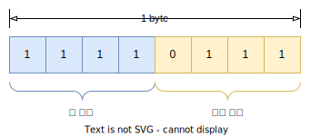

존 형식으로 10진수를 표현할 때 최하위 바이트의 존 영역은 부호를 표시하기 위해 사용된다. 1100(C)는 (+) 부호, 1101(D)는 (-) 부호이다.

10진수 -6927을 존 형식으로 나타내면 다음과 같다.

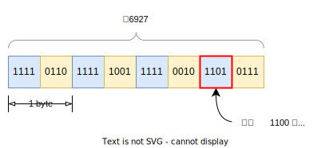

 

### 팩 형식 - Packed-Decimal Format

---

팩 형식은 1byte에 10진수 두 자리를 표현하고 최하위 바이트의 하위 4bit에 부호를 표시한다.

10진수 6648996을 팩 형식으로 나타내면 다음과 같다.

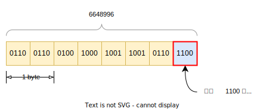

팩 형식은 최하위 바이트의 하위 4bit를 제외한 모든 영역을 수치를 나타내기위해 사용하므로 존 형식에 비해 공간이 절약된다.

:::info 팩 형식 연산

존 형식은 데이터 연산이 불가능하기 때문에 팩 형식으로 변환해야 연산할 수 있다. 존 형식을 팩 형식으로 변환하는 것과 팩 형식 연산에 대해서는 다음 자료를 참고하자. [Packed Decimal Instructions](https://faculty.cs.niu.edu/~byrnes/csci360/notes/360pack.htm)

:::

 

## 2진수 표현

---

컴퓨터는 2진수를 일정 길이의 비트로 표현한다. 보통 최상위 1bit(**MSB** - Most Significant Bit)를 부호를 나타내는데 사용하며 0인 경우 (+), 1인 경우 (-)이다. MSB를 제외한 나머지 비트에 2진수 값을 표시한다. 값을 표시하는 방식에 따라 부호 절대값, 1의 보수, 2의 보수 등으로 나뉜다.

### 부호 절대값 - Sign-magnitude

---

부호 절대값 형식은 MSB를 부호 비트로 사용하고 남은 비트에 2진수 절대값을 넣는다.

8bit기준으로 +23을 부호 절대값 형식으로 표현하면 다음과 같다.

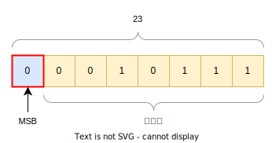

#### 부호 절대값 정리

- 표현 범위: n bit → $-(2^{n - 1} - 1) \sim +(2^{n - 1} - 1)$
- 장점: 부호 비트만 주의하면 값을 직관적으로 이해할 수 있다. (사람 기준)
- 단점
  - -0과 +0이 각각 존재한다. (논리적 모순)
  - 뺄셈을 구현할 때 고려할 사항이 많다. (회로 구성이 복잡함)

 

### 1의 보수 - Ones' complement

---

1의 보수 형식은 양수의 경우 부호 절대값과 같은 방법으로 나타내고 음수의 경우 부호 비트를 제외한 나머지 비트에 2진수를 1의 보수로 나타낸다. 1의 보수는 2진수 각 자리값을 반전시키면 구할 수 있다.

8bit로 -21을 1의 보수 형식으로 나타내면 다음과 같다. 참고로 +21은 $00010101_{(2)}$이며 1의 보수를 구하면 $11101010_{(2)}$이 된다.

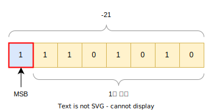

#### 1의 보수 뺄셈법

1의 보수 형식을 이용하면 뺄셈을 덧셈으로 처리할 수 있다. 일반적으로 수학에서 1의 보수를 사용해 뺄셈을 덧셈으로 처리하는 방법은 다음과 같다.

1. 피감수, 감수의 1의 보수를 더한다.
2. 최상위 자리의 자리올림(캐리)이 있으면 캐리를 무시하고 1을 더한다.
3. 최상위 자리의 자리올림(캐리)이 없으면 결과값에 1의 보수를 구하고 음수취급 한다.

1의 보수 뺄셈을 컴퓨터에 도입하면 더 간단해진다. 캐리 발생 유무만 파악해서 캐리가 있으면 +1하고 없는 경우 그대로 둔다. 부호 비트를 확인해서 0인 경우 나머지 비트를 절대값으로 읽고 1인 경우 1의 보수로 읽으면 된다.

#### 결과가 양수인 뺄셈

8bit 기준 $15 - 8$을 1의 보수 형식으로 나타내어 계산하면 다음과 같다.

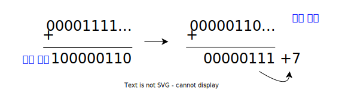

-8을 1의 보수 형식으로 표현하고 15와 더한다. MSB에서 캐리가 발생했으므로 캐리를 무시하고 결과값에 1을 더한다. 부호 비트 0이므로 나머지 비트를 절대값으로 읽으면 답은 +7이다.

#### 결과가 음수인 뺄셈

8bit 기준 $8 - 15$을 1의 보수 형식으로 나타내어 계산하면 다음과 같다.

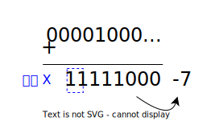

-15를 1의 보수 형식으로 표현하고 8과 더한다.MSB에서 캐리가 발생하지 않았고 부호 비트 1이므로 나머지 비트를 1의 보수로 계산해보면 답은 -7이다.

#### 음수끼리의 연산

8bit 기준 $-15 -8$을 1의 보수 형식으로 나타내어 계산하면 다음과 같다.


각 수를 1의 보수 형식으로 표현하고 더한다. MSB에 캐리가 있으므로 캐리를 무시하고 결과값에 1을 더한다. 부호 비트 1이므로 나머지 비트를 1의 보수로 계산해보면 답은 -23이다.

#### 1의 보수 정리

- 표현 범위: n bit → $-(2^{n - 1} - 1) \sim +(2^{n - 1} - 1)$
- 장점: 뺄셈을 덧셈으로 처리할 수 있다. (회로 구성이 비교적 쉬움)
- 단점:
  - -0과 +0이 각각 존재한다. (논리적 모순)
  - 캐리 발생 시 +1 처리를 해야한다.

:::tip 덧셈으로 사칙연산 처리하기

보수를 사용하면 이론상 사칙연산을 모두 덧셈으로 처리할 수 있다. 뺄셈은 보수를 써서 덧셈으로 처리하면 되고 곱셈은 덧셈의 연속, 나눗셈은 뺄셈의 연속으로 처리할 수 있기 때문이다.

:::

 

### 2의 보수 - Two's complement

---

2의 보수 형식은 **실제 컴퓨터에서 사용하는 방식**으로 양수는 부호 절대값과 같은 방식으로 표현하고 음수의 경우 부호 비트를 제외한 나머지 비트에 2진수를 2의 보수로 나타낸다. 2의 보수는 구해진 1의 보수에서 1을 더해서 구할 수 있다. (비트 반전 후 +1)

8bit 기준 -29을 2의 보수 형식으로 나타내면 다음과 같다. 참고로 +29는 $00011101_{(2)}$이며 2의 보수를 구하면 $11100011_{(2)}$이 된다.

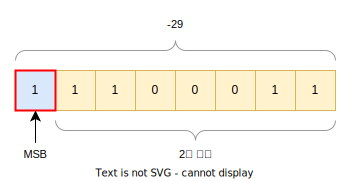

#### 2의 보수 뺄셈법

2의 보수 또한 뺄셈을 덧셈으로 처리할 수 있다. 2의 보수를 이용한 뺄셈법은 다음과 같다.

1. 피감수, 감수의 2의 보수를 더한다.
2. 최상위 자리의 자리올림(캐리)이 있으면 캐리를 무시한다.
3. 최상위 자리의 자리올림(캐리)이 없으면 결과값의 2의 보수를 구하고 음수 취급한다.

2의 보수 뺄셈을 컴퓨터에 적용하면 1의 보수보다 더 간단해진다. 캐리는 무조건 무시하고 부호 비트에 맞게 부호 비트 0이면 나머지 비트를 절대값으로 읽고 부호 비트 1이면 나머지 비트를 2의 보수로 읽으면 된다.

#### 결과가 양수인 뺄셈

8bit 기준 $23 - 16$을 2의 보수 형식으로 나타내어 계산하면 다음과 같다.

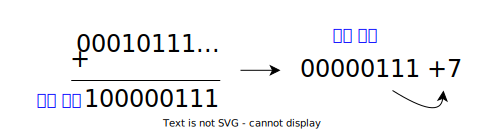

-16의 2의 보수 형식으로 표현하고 23과 더한다. MSB에서 발생한 캐리를 무시하고 부호 비트 0이므로 나머지 비트를 절대값으로 읽으면 답은 +7이다.

#### 결과가 음수인 뺄셈

8bit 기준 $23 - 36$을 2의 보수 형식으로 나타내어 계산하면 다음과 같다.

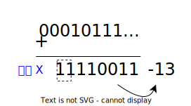

-36을 2의 보수 형식으로 나타내고 23과 더한다. MSB에 캐리가 없고 부호 비트 1이므로 나머지 비트를 2의 보수로 읽으면 -13이다.

#### 음수끼리의 연산

8bit 기준 $-23 -6$을 2의 보수 형식으로 나타내어 계산하면 다음과 같다.

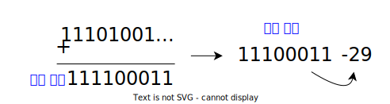

각 수를 2의 보수 형식으로 나타내고 더한다. MSB에서 발생한 캐리를 무시하고 부호 비트 1이므로 나머지 비트를 2의 보수로 읽으면 -29이다.

#### 2의 보수 정리

- 실제 컴퓨터에서 사용하는 방식
- 표현 범위: n bit → $-(2^{n - 1}) \sim +(2^{n - 1} - 1)$
- 장점
  - 뺄셈을 덧셈으로 처리할 수 있다. (회로 구성이 비교적 쉬움)
  - 캐리 발생 시 처리가 간단한다.
  - -0, +0이 동일한 값으로 표현된다. (논리적 모순 없음)

 

### -0과 +0

---

8bit 기준에서 부호 절대값, 1의 보수, 2의 보수 모두 +0은 모든 자리 비트 0으로 동일하다. 그러나 -0은 부호 절대값에서는 $10000000_{(2)}$이고 1의 보수에서는 $11111111_{(2)}$이다. 따라서 -0, +0 모두 같은 0인데도 실제 표현되는 값이 다른 모순이 발생한다.

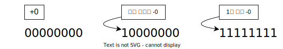

반면에 2의 보수에서는 -0과 +0이 같은 값으로 표현된다. 과정을 보면 -0을 나타내기 위해서 부호 비트를 1로 설정한 뒤 2의 보수를 구하기 위해 비트를 반전한 뒤 1을 더한다. 캐리가 발생하므로 캐리를 무시하면 모든 비트 0이 되어 +0과 같은 값이 된다.


 

### 정수형 오버플로

---

정수형 데이터를 연산할 때 연산의 결과가 값의 범위를 벗어나는 경우 예상되는 결과와 다른 값이 나오게 되는데 이를 오버플로(overflow)라고 하며 양수끼리 또는 음수끼리의 계산에서 발생한다.

부호 절대값, 1의 보수, 2의 보수 모두 같은 원리로 오버플로가 발생한다. 때문에 정수형 연산에서는 <u>유효 범위내</u>에서 연산을 수행해야 한다.

#### 양수 오버플로

2의 보수 표현에서 8bit 기준 최대값인 127에 1을 더하면 일반적인 예상은 128이다. 그러나 실제결과는 최소값인 -128이 나온다.

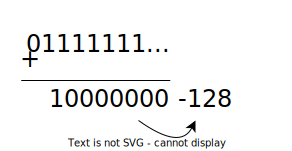

127에 1을 더하면 각 비트에서 자리올림이 발생하고 부호 비트에 1이 더해지게 된다. 그 결과 부호 비트가 반전되어 부호가 변경되고 나머지 비트를 2의 보수로 읽을 경우 -128이 된다.

#### 음수 오버플로

2의 보수 표현에서 8bit 기준 최소값인 -128에 1을 빼면 일반적인 예상은 -129이다. 그러나 실졔결과는 최대값인 127이 나온다.

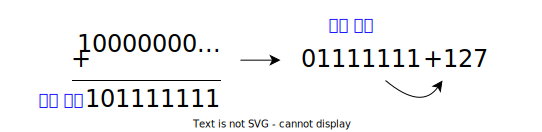

-128에 숫자 1에 대한 2의 보수를 더하게 되면 MSB에서 캐리가 발생하고 캐리를 무시하고 부호 비트 0이므로 나머지 비트를 절대값으로 읽으면 최대값인 127이 된다.

## Reference

---

- [C로 배우는 쉬운 자료구조 - 이지영(한빛아카데미)](https://books.google.co.kr/books?id=fwryDwAAQBAJ&dq=c%EB%A1%9C+%EB%B0%B0%EC%9A%B0%EB%8A%94+%EC%89%AC%EC%9A%B4+%EC%9E%90%EB%A3%8C%EA%B5%AC%EC%A1%B0&hl=ko&source=gbs_navlinks_s)
- [1의 보수와 2의 보수를 이해하자! - 안경잡이개발자](https://ndb796.tistory.com/4)
- [2진수의 수와 음수 표현법 [1의 보수와 2의 보수] - Stranger's LAB](https://st-lab.tistory.com/189)
