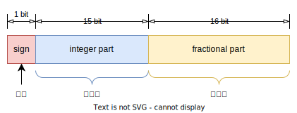
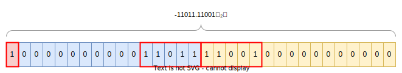
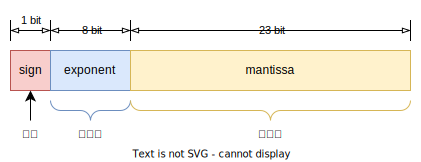
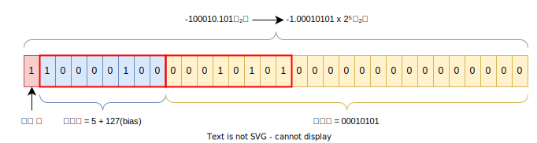
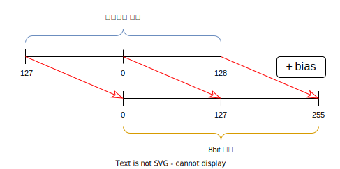

# 실수형 데이터 표현

---

컴퓨터는 소수점 있는 실수(real number)를 고정소수점, 부동소수점 등의 방식으로 나타낸다. 컴퓨터는 2진수를 사용하므로 소수점 자체를 나타낼 수 없다. 따라서 메모리 공간을 일정한 규칙에 의해 나누어서 실수 데이터를 표현한다.

## 고정소수점 - Fixed point

---

고정소수점 방식은 최상위 1bit(MSB)로 부호를 나타내고 나머지 비트를 정수부(integer part)와 소수부(fractional part)로 나누어 사용한다.

32bit 기준 고정소수점 방식은 다음과 같다.

정수부와 소수부의 경계를 소수점으로 가정하고 정수와 소수를 넣고 나머지 비트를 0으로 채운다. 실수 $-11011.11001_{(2)}$을 32bit 고정수소점으로 표현하면 다음과 같다.

고정소수점 방식은 한정된 공간에 나타낼 수 있는 값의 범위가 비교적 좁다. 따라서 아주 큰값 또는 아주 작은값을 나타내기에는 부적절하다.

## 부동소수점 - Floating point

---

부동소수점 방식은 [IEEE 754](https://en.wikipedia.org/wiki/IEEE_754) 표준으로 실수를 부호(sign), 지수부(exponent), 가수부(mantissa)로 나누어 표현한다.

32bit 단정밀도 부동소수점은 다음과 같다.

사용하는 공간의 크기에 따라 반정밀도(Half precision), 단정밀도(Single precision), 배정밀도(Double precision)등으로 구분된다. 더 많은 공간을 사용할수록 가수부의 크기가 커지므로 정밀도가 높아진다.

### 부동소수점 표현 방법

---

부동소수점 방식은 실수를 표현할 때 해당 실수의 정수부분을 1로 만들고 과학적 표기법으로 나타낸 뒤 지수와 가수를 나누어 저장한다. 과정은 다음과 같다.

- 부동소수점 표현 절차
  - 정규화(normalization) - 정수부분이 1이 되도록 소수점을 이동하고 과학적 표기법으로 표시
  - 부호(sign) - 양수면 0 음수면 1을 부호 비트에 저장
  - 지수부(exponent) - 정규화 이후 구해진 지수에 bias를 더해서 저장
  - 가수부(mantissa) - 정규화 이후 소수부분을 저장

실수를 정규화하면 정수부분은 무조건 1이 되므로 1은 생략한다.

예를 들어 실수 $-100010.101_{(2)}$ (10진수 -34.625)을 32bit 단정밀도 부동소수점으로 표현하면 다음과 같다.

1. 정규화: $-100010.101 \to -1.00010101 \times 2^5$
2. 부호: 음수이므로 부호 비트 1
3. 가수부: 소수부분 00010101을 저장하고 남는 공간 0으로 채움
4. 지수부: 지수 5에 127(bias)을 더한 132를 저장

 

### bias

---

부동소수점 방식에서 지수부는 매우 작은(0에 가까운)값을 나타내기 위해 음수값도 저장할 수 있어야 한다. 이를 위해 사용하는 것이 bias로 정규화된 실수의 지수에 더해져서 지수를 표현가능한 범위내로 편향 시킨다.

단정밀도 기준 지수부는 8bit이므로 0 ~ 255까지 나타낼 수 있다. 따라서 -127 ~ 128의 범위에 속하는 숫자에 bias인 127을 더하면 0 ~ 255 범위로 들어오게 된다.

bias값은 지수부가 nbit일 때 $\dfrac{2^n - 1}{2}$에서 소수점이하를 버리면 구할 수 있다.

:::note 지수부에서 부호 비트를 쓰지 않는 이유

지수부에 부호 비트와 보수를 이용할 경우 값의 비교등의 연산이 더 복잡해지기 때문에 bias를 사용해서 음수 지수를 처리한다.

:::

 

### 부동소수점 값

---

부동소수점 방식은 정규화된 값과 더불어 비정규화 값, 무한대, NaN 등 몇 가지 특수한 값도 표현한다. 일부 특수한 값은 지수부의 모든 비트가 0또는 1로 예약되어 있다. 다음은 32bit 단정밀도 기준 부동소수점 방식으로 나타낼 수 있는 값이다.

| 부호(sign) | 지수부 (exponent)  |                         가수부 (mantissa)                         | 의미                            |
| :--------: | :----------------: | :---------------------------------------------------------------: | ------------------------------- |
|   0 or 1   | $0000 \space 0000$ | $000 \space 0000 \space 0000 \space 0000 \space 0000 \space 0000$ | +0, -0                          |
|   0 or 1   | $0111 \space 1111$ | $000 \space 0000 \space 0000 \space 0000 \space 0000 \space 0000$ | +1.0, -1.0                      |
|   0 or 1   | $0000 \space 0000$ | $000 \space 0000 \space 0000 \space 0000 \space 0000 \space 0001$ | Smallest denormalized number    |
|   0 or 1   | $0000 \space 0000$ | $100 \space 0000 \space 0000 \space 0000 \space 0000 \space 0000$ | Middle denormalized number      |
|   0 or 1   | $0000 \space 0000$ | $111 \space 1111 \space 1111 \space 1111 \space 1111 \space 1111$ | Largest denormalized number     |
|   0 or 1   | $0000 \space 0001$ | $000 \space 0000 \space 0000 \space 0000 \space 0000 \space 0000$ | Smallest normalized number      |
|   0 or 1   | $1111 \space 1110$ | $111 \space 1111 \space 1111 \space 1111 \space 1111 \space 1111$ | Largest normalized number       |
|   0 or 1   | $1111 \space 1111$ | $000 \space 0000 \space 0000 \space 0000 \space 0000 \space 0000$ | $+\infty$, $-\infty$ (Infinity) |
|   0 or 1   | $1111 \space 1111$ |                  비트 중 하나라도 0이 아닌 경우                   | NaN (Not a Number)              |

#### Normalized number

정수부분을 1로 나타내어 과학적 표기법으로 타나낸 값을 의미한다. 예를 들어 $1.0110101101001 \times 2^6$ 는 $1011010.1101001$ 를 정규화한 정규화 값(Normalized number)이다. 일반적으로 특정 정밀도내에서 표현 가능한 값이 여기에 해당한다.

#### Denormalized number

비정규화 값(Denormalized number)은 정규화할 수 있는 가장 작은값보다 더 작아서(0에 매우 가까워서) 정규화할 수 없는 값으로 정규화할 경우 지수가 지수부보다 커서 표현이 불가능한 값이다. 부동소수점 방식에서는 지수부의 모든 비트가 0이면 비정규화값으로 취급한다.

비정규화 값은 부동소수점 연산의 결과로 매우 작은(0에 한없이 가까운)값이 나왔을 때 정밀도 손실을 줄이기 위해 사용된다. 자세한 내용은 다음 자료를 참고하자. [산술 언더플로](https://en.wikipedia.org/wiki/Arithmetic_underflow)

#### NaN

음수의 제곱근, $0.0 \div 0.0$ 등의 연산은 유효한 결과를 낼 수 없으므로 부동소수점 예외로 취급한다. NaN은 Not a Number의 줄임말로 이러한 연산의 결과를 의미한다.

#### Infinity

표현 가능한 값의 범위를 벗어나는 매우 큰 값을 의미한다.

 

### 부동소수점 값의 범위

---

부동소수점 값의 범위는 정규화 가능한 값의 범위와 비정규화 값의 범위로 구분할 수 있다. 32bit 단정밀도 기준 표현가능한 값의 범위는 다음과 같다.

| 구분                | 범위                                                 |
| ------------------- | ---------------------------------------------------- |
| Normalized number   | 약 $+1.18 \times 10^{-38} \sim +3.4 \times 10^{38}$  |
| Normalized number   | 약 $-1.18 \times 10^{-38} \sim -3.4 \times 10^{38}$  |
| Denormalized number | 약 $+1.4 \times 10^{-45} \sim +1.18 \times 10^{-38}$ |
| Denormalized number | 약 $-1.4 \times 10^{-45} \sim -1.18 \times 10^{-38}$ |
| 전체 범위           | $+1.4 \times 10^{-45} \sim +3.4 \times 10^{38}$      |
| 전체 범위           | $-1.4 \times 10^{-45} \sim -3.4 \times 10^{38}$      |

:::caution

소수점아래 값은 자리수가 무한대로 늘어날 수 있으므로 부동소수점 값의 범위가 실제로 해당 범위에 속하는 모든 실수를 표현할 수는 없다.

:::

 

## 오차 문제

---

고정소수점이든 부동소수점이든 실수를 저정할 때는 오차발생에 주의해야 한다. 10진수 실수를 2진수 실수로 변환할 때 소수점아래가 딱 맞아 떨어지지 않는 경우가 있기 때문이다. 10진수 $0.1$ 을 2진수로 바꾸면 $0.0000110011001100\cdots_{(2)}$ 로 순환하는 값이 된다. 그 결과 한정된 공간에 데이터를 표현해야 하는 컴퓨터는 정확한 값이 아닌 근사값을 사용하게 된다.

간단한 예로 $0.1 + 0.1 + 0.1$의 결과는 $0.3$이지만 실제 프로그래밍 언어에서 계산해보면 $0.30000000000000004$ 이 나온다.

이런 오차를 방지하고 아주 정확한 값을 얻으려면 프로그래밍 언어에서 제공하는 라이브러리를 사용해서 계산해야 한다. 자바의 경우 `BigDeciaml` 을 사용할 수 있다.

## Reference

---

- [C로 배우는 쉬운 자료구조 - 이지영(한빛아카데미)](https://books.google.co.kr/books?id=fwryDwAAQBAJ&dq=c%EB%A1%9C+%EB%B0%B0%EC%9A%B0%EB%8A%94+%EC%89%AC%EC%9A%B4+%EC%9E%90%EB%A3%8C%EA%B5%AC%EC%A1%B0&hl=ko&source=gbs_navlinks_s)
- [CS50 - 고정 소수점(fixed point)과 부동 소수점(floating point) - Gukwon Koo](https://gguguk.github.io/posts/fixed_point_and_floating_point/)
- [IEEE 754 - wikipedia](https://en.wikipedia.org/wiki/IEEE_754)
- [IEEE 754 1985 - wikipedia](https://en.wikipedia.org/wiki/IEEE_754-1985)
- [Exponent bias - wikipedia](https://en.wikipedia.org/wiki/Exponent_bias)
